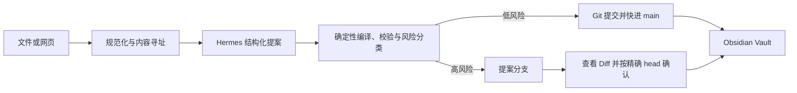

# ZhanluSpace

Zhanlu Knowledge 是一个以普通 Markdown、YAML Frontmatter 和 Git 为事实层的个人知识库编译器。Obsidian 提供最终阅读、编辑和关系可视化界面；Hermes 只生成结构化知识提案；确定性 Worker 负责路径、Schema、关系、风险与 Git 事务。

第一阶段已经支持单个 Markdown/TXT 文件和 HTTP/HTTPS 网页。PDF、DOCX、OCR 与团队 GitHub PR 工作流属于后续阶段，当前版本不假装支持。



## 当前能力

- 拖入一个本地 `.md`/`.txt` 文件，或输入一个 `http`/`https` URL。
- 网页正文清洗、文本规范化、SHA-256 内容寻址与重复素材识别。
- Hermes 在隔离作业目录中返回严格 JSON 提案，不能自行选择文件路径或执行 Git。
- 知识、来源、关系均使用稳定 ID；Obsidian Wikilink 是可重新生成的显示层。
- 低风险新增自动创建审计提交并快进本地 `main`。
- 修改既有知识、反驳或取代等高风险变化停在提案分支，必须查看差异后确认精确 branch/head。
- 脏工作区、过期提案、无效模型输出、超时、取消或校验失败不会覆盖无关用户修改。
- 不安装 Obsidian 时，Vault 仍然是可读、可迁移、可校验的 Markdown/Git 仓库。

## 快速开始

### 1. 准备 Vault

新建空目录，把 `vault-template/`（包括隐藏的 `.gitignore` 和 `.gitattributes`）复制进去，然后初始化本地 `main`：

```powershell
$vault = "D:\path\to\knowledge-vault"
New-Item -ItemType Directory -Force -Path $vault | Out-Null
Get-ChildItem -Force .\vault-template | Copy-Item -Destination $vault -Recurse -Force
git -C $vault init -b main
git -C $vault add .
git -C $vault commit -m "Initialize knowledge vault"
```

先用 Obsidian 打开该目录一次，让它创建 `.obsidian/`。

### 2. 配置 Hermes

已安装的 Hermes 版本应能完成一次纯推理命令：

```powershell
hermes model
hermes --ignore-rules -z "Return one JSON object with key smoke and value ok."
```

模型密钥由 Hermes、本地模型服务或环境变量管理。插件只保存 Hermes 可执行文件和配置名称，不保存 API Key、GitHub Token 或模型响应。

### 3. 安装插件与 Worker

```powershell
.\scripts\install-plugin.ps1 `
  -VaultPath $vault `
  -PythonPath "C:\path\to\python.exe" `
  -HermesPath "C:\path\to\hermes.exe" `
  -NodePath "C:\path\to\node.exe" `
  -PnpmPath "C:\path\to\pnpm.cmd"
```

脚本拒绝仓库源码根目录、用户主目录、盘符根目录、非 Git Vault 和尚未由 Obsidian 打开的目录。它在插件目录内安装独立 Worker 环境，并通过本地 Git exclude 保持 Vault 干净。

在 Obsidian 的“第三方插件”中启用 Zhanlu Knowledge，再点击左侧书本加号或运行命令“打开斩律知识导入”。插件设置里的“检测环境”不会读取素材，可以先验证 Python Worker、Hermes 与 Git。

## 使用与恢复

导入页会在开始前显示 Hermes 配置和数据去向。运行中依次显示排队、读取、提取、编译、校验、提交与合入；随时可以取消。

- 低风险结果：位于 `main`，可使用插件复制的 `git show --stat --oneline <head>` 检查提交。
- 高风险结果：位于 `knowledge/<日期>-<任务>`，先运行复制的 `git diff main...<branch>`，再点击“确认合入”。
- 失败作业：诊断与暂存材料位于 `.knowledge-runtime/jobs/<job-id>/`，该目录不进入 Git。
- 工作区不干净：先自行 commit 或 stash；Worker 不会替用户丢弃修改。
- 高风险提案暂不接受：保留分支即可；确认前不要改写或强推该分支。

更完整的人工验收步骤见 [docs/manual-test.md](docs/manual-test.md)，开发与验证环境见 [docs/development.md](docs/development.md)。

## 卸载

在 Obsidian 中停用插件并关闭应用，然后删除 Vault 下的 `.obsidian/plugins/zhanlu-knowledge/`。如不需要诊断记录，可在确认绝对路径属于该 Vault 后删除 `.knowledge-runtime/`。知识、来源与 Git 历史不会随插件卸载而删除。

## 明确限制

- 第一阶段只接受单个 Markdown/TXT 文件或 URL；不支持批量目录、PDF、DOCX、PPTX、XLSX、图片 OCR、音频或视频。
- 尚未实现 GitHub push/PR、Knowledge CI、CODEOWNERS、团队审批或合入后同步。
- URL 获取仅处理可直接访问的 HTML，不负责登录态、付费墙、复杂 JavaScript 渲染或反爬绕过。
- 真实模型质量与费用取决于用户选择的 Hermes 提供商；Worker 只能保证提案边界和确定性落盘，不能保证模型陈述必然正确。
- 第一阶段仅支持 Obsidian 桌面版和本地文件系统 Vault。

## 验证

```powershell
.\scripts\verify.ps1 `
  -PythonPath ".\.venv\Scripts\python.exe" `
  -NodePath "C:\path\to\node.exe" `
  -PnpmPath "C:\path\to\pnpm.cmd"
```

该命令运行 Python 单元/E2E、覆盖率、插件测试、类型检查、生产构建和 `git diff --check`。当前基线为 96 个 Python 测试、36 个插件测试，Worker 覆盖率 92%。

## 设计资料

- [批准的系统设计](docs/superpowers/specs/2026-08-03-obsidian-hermes-knowledge-vault-design.md)
- [第一阶段实施计划](docs/superpowers/plans/2026-08-03-local-personal-knowledge-loop.md)
- [依赖许可证审计](docs/licenses.md)
