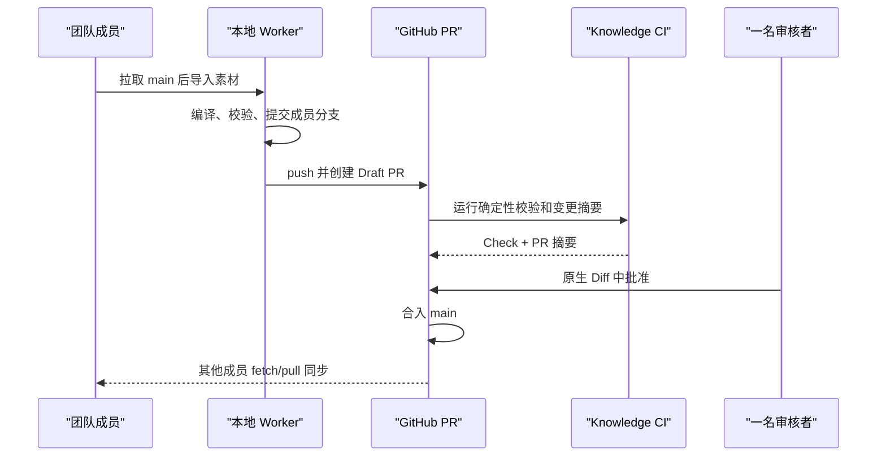

# 团队 GitHub PR 知识库计划

> 状态：待评审；目标是使用原生 GitHub PR 作为唯一审核动作，不建设额外审核工作台。

## 目标工作流

团队成员从最新 `main` 开始，在自己的本地 Vault 中导入新素材。Worker 生成素材记录、知识变化、关系变化和 ingest manifest，提交到成员分支并推送。系统创建 Draft PR，自动说明新增、修改、取代、关系、来源和风险。任意一名有权限的审核者批准后，GitHub 合入；其他成员在工作区干净时同步最新 `main`，Obsidian 直接展示结果。

## 原则

- GitHub PR、Checks、Review、CODEOWNERS/Ruleset 是审核事实源；插件不复制评论、批准或合入 UI。
- 团队模式禁止本地自动合入，即使风险为低；所有知识变化都必须经过 PR。
- 审核人数为一人。仓库规则要求至少一个批准，并阻止提交者自行满足审批（如组织权限允许）。
- CI 不重新调用 Hermes，不让同一 PR 因模型随机性变化；CI 只验证已提交的确定性产物。
- PR 中不包含模型密钥、GitHub Token、运行时日志或未批准的私密素材。
- 正式关系继续使用稳定 ID/YAML；Obsidian 图谱只是派生显示。

## 实施任务

### 任务 1：团队模式配置与权限边界

- 增加 `mode: personal | team`、GitHub owner/repo、默认分支、remote 名称和团队模型策略标识。
- Token 只通过 GitHub CLI/系统凭据管理器或 GitHub App 获得，插件数据中不保存明文 Token。
- 启动团队作业前验证 remote URL、用户身份、仓库根、干净工作区、当前 `main` 和已同步远端 head。
- 为 fork、组织仓库、无 push 权限和离线状态给出明确错误，不自动扩大权限。

### 任务 2：团队 Git 事务

- 复用现有确定性编译和校验，但团队结果始终停在唯一命名的成员分支。
- 在 push 前再次确认 branch/head、远端 main 基线和 staged path 白名单。
- 使用参数数组调用 Git/GitHub CLI；禁止拼接 Shell、force-push、重写公开历史或自动删除未合入分支。
- push 失败可重试，但不得重复生成知识 ID、manifest 或 PR。

### 任务 3：PR 创建和幂等更新

- 以 ingest ID 写入隐藏 PR 标记，使重复点击只更新同一个 Draft PR。
- 标题和正文来自确定性 manifest/diff，不直接使用未验证模型文案。
- PR 正文至少包含：来源、知识新增/修改/取代、关系变化、文件清单、风险原因、提取器/Hermes/compiler 版本和验证命令。
- 不上传完整运行日志；网页/文件正文是否进入仓库由 Vault 数据政策决定。

### 任务 4：Knowledge CI

- 新增只读验证命令，校验整个 Vault、稳定 ID 唯一性、来源/关系引用、派生 Wikilink、manifest、一致换行和禁止路径。
- 校验 PR 只修改允许的 Vault 根目录；插件源码或 CI 配置变化走独立维护者流程。
- 生成机器可读 `knowledge-change-summary.json` 和 Markdown 摘要，作为 Check Summary 或单一可更新 PR 评论。
- CI 使用最小权限，默认只读 contents/pull-requests；需要写评论时单独授予最小 pull-request write。
- 对来自 fork 的 PR 不执行需要秘密的步骤。

### 任务 5：仓库规则与一人审核

- 提供 `.github/CODEOWNERS` 模板和 GitHub Ruleset 配置说明。
- `main` 禁止直接 push，要求 Knowledge CI 成功、分支最新、至少一个批准和已解决 review threads。
- 审核者直接使用 GitHub Files changed/Obsidian 本地 checkout；不开发额外审核工作台。
- 高风险原因必须在摘要顶部显示，但审批人数仍按已确认要求为一人。

### 任务 6：合入后同步

- 插件定期或手动执行只读 fetch，显示本地落后数量。
- 仅当处于干净 `main` 且可快进时提供“一键同步”；否则只展示安全命令和原因。
- 同步完成后重新校验 Vault 并让 Obsidian 刷新；失败不 reset-hard、不丢弃成员修改。
- PR 分支删除由 GitHub 仓库策略处理，本地只删除确认已合入且无独有提交的分支。

### 任务 7：测试与发布

- 使用临时 bare remote 和两个克隆测试：成员 A 提交、CI 验证、一人批准模拟、合入、成员 B 同步。
- GitHub API/CLI 使用契约替身测试权限、速率限制、重复 PR、过期 main、fork 和拒绝审批。
- 在测试 GitHub 仓库做真实冒烟，不使用生产知识或个人密钥。
- 更新安装、团队管理员指南、成员指南、故障恢复、数据政策和许可证审计。

## 验收标准

- 每个团队知识变化都能追溯到成员提交、PR、一个批准和合入 commit。
- PR 自动摘要与实际 Git diff/manifest 一致，不依赖模型再次生成。
- 未通过 Knowledge CI、无人批准、main 已变化或权限不足时不能合入。
- 合入后另一成员能在干净 main 上安全快进并立即用 Obsidian 阅读。
- GitHub 不可用时本地提案不会丢失，也不会被误标成已提交审核。
- 全流程没有自建审核工作台；GitHub 是唯一审核界面。
